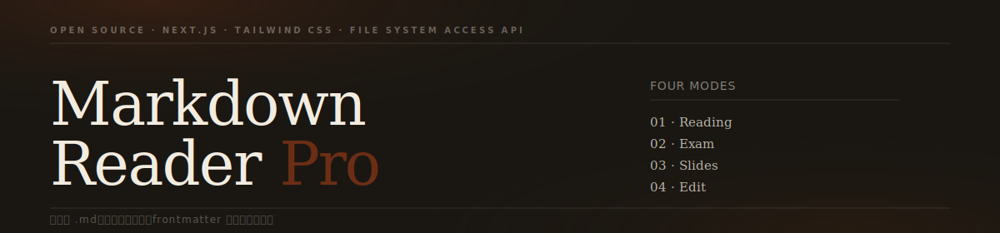

# Markdown Reader Pro

多模式 Markdown 閱讀器。上傳或開啟本地 `.md` 檔案，依 frontmatter 自動切換四種模式：**閱讀、考試、簡報、編輯**。

## Quick Start

此專案採 Docker-first 開發流程，不需要在本機安裝 Node 或 pnpm。

```bash
docker compose up app
```

啟動後開啟 `http://localhost:3000`。

常用驗收指令：

```bash
docker compose run --rm app pnpm lint
docker compose run --rm app pnpm test
docker compose run --rm app pnpm build
```

## 正式部署（Production）

適用於 Raspberry Pi 或伺服器環境。Container 啟動時完整編譯，使用者連線後即時回應。

```bash
# 首次啟動（含 build）
docker compose -f docker-compose.product.yml up -d --build

# 更新程式碼後重新部署
docker compose -f docker-compose.product.yml up -d --build

# 停止服務
docker compose -f docker-compose.product.yml down
```

重開機會自動恢復運行，無需額外設定。

## 功能一覽

### 上傳 / 開啟

- 首頁拖放或選取 `.md`、`.markdown`、`.txt`
- **File System Access API 資料夾模式**：側邊欄授權本地資料夾，雙擊切換檔案，支援建立、刪除、重命名
- Zustand + `sessionStorage` 持久化，重整後仍保留目前文件與答題狀態
- frontmatter `type` 自動決定模式；未提供時預設 Reading

### Reading 模式

- Magazine 印刷排版（Newsreader 字型、黑棕色調）
- 目錄自動生成（根據 heading 層級）
- 閱讀進度追蹤
- code block 語法高亮與一鍵複製
- 圖片支援（外部 URL 或本地資料夾相對路徑）

### Exam 模式

- 單選 / 複選題、題目與選項隨機排列
- sessionStorage 作答持久化
- 倒數計時與自動提交
- 結果頁：score ring 視覺化、正確 / 錯誤 / 跳過統計
- 錯題詳解（時間軸式排列）、答對題目可折疊

### Slides 模式

- `---`（單獨一行）切頁，code fence 內不受影響
- `<!-- speaker: ... -->` 解析為講者備忘
- 鍵盤快捷鍵（`→`/`←`、`S` 講者模式、`O` 概覽、`F` 全螢幕）
- `window.print()` PDF 匯出，自動套用 `@media print` 排版

### Edit 模式

- CodeMirror 6 編輯器，左欄編輯右欄即時預覽
- 語法高亮、未存變更警告（`⌘S` 快捷鍵、browser beforeunload）
- **FSAccess 儲存**：授權資料夾後直接覆寫原檔，不需要重新下載
- 下載 `.md` 副本
- 四種新建範本（Reading / Exam / Slides / Edit）

### 本地圖片（資料夾模式）

以 File System Access API 開啟資料夾後，markdown 中的相對路徑圖片自動顯示：

```markdown


```

外部 URL（`https://...`）在所有模式下均直接可用，無需授權資料夾。

## Frontmatter 格式

### Reading

```yaml
---
title: 文件標題
author: 作者
date: 2026-05-10
tags: [react, typescript]
---
```

支援 GFM 內容：heading、code block、table、task list、blockquote、image。

### Exam

```yaml
---
type: quiz
title: JavaScript 基礎測驗
shuffle: true
shuffleOptions: true
passingScore: 70
timeLimit: 600
---

## Q1
type: single
answer: B

題目文字

A. 選項 A
B. 選項 B（正確）
C. 選項 C

> 解析: 詳解文字
```

規則：

- 題目以 `## Q{n}` 開頭（`n` 為任意正整數）
- 題目下方宣告 `type: single` 或 `type: multi`
- `answer` 單選寫 `answer: B`，複選寫 `answer: [B, D]`
- 選項使用 `A.` `B.` `C.` `D.` 結構化前綴
- 詳解使用 `> 解析:`

### Slides

```yaml
---
type: slides
title: 我的簡報
theme: minimal
aspectRatio: "16:9"
---

# 第一頁

內容

---

## 第二頁
<!-- speaker: 講者備忘 -->
```

規則：

- 單獨一行的 `---` 切頁；code block 內的 `---` 不切頁
- `<!-- speaker: ... -->` 解析成 speaker notes
- `theme`：`default`、`dark`、`minimal`
- `aspectRatio`：`16:9`、`4:3`

完整規格：[docs/template-spec.md](docs/template-spec.md)

## 內建範例

`frontend/public/samples/` 提供三份範例：

| 檔案 | 模式 | 說明 |
|------|------|------|
| `reading-sample.md` | Reading | 長文排版壓力測試，包含表格、圖片、code block |
| `exam-sample.md` | Exam | 混合單選/複選、計時、詳解 |
| `slides-sample.md` | Slides | Feature tour，含圖片範例與講者備忘 |

首頁 Sample Cards 可直接載入，無需手動上傳。

## 設計系統

兩套主題，依頁面自動切換：

| 主題 | 頁面 | 特徵 |
|------|------|------|
| **Magazine** | 首頁、Reading、Slides | Newsreader 字型、深紅色調、無圓角、無陰影 |
| **Documented Warmth** | Exam、Edit | 綠色調、軟陰影、大圓角（14–28px） |

## Known Limitations

- 文件與考試狀態保存在 `sessionStorage`，關閉分頁後不會跨裝置同步
- Slides PDF 匯出依賴 `window.print()`，非獨立排版引擎
- Exam 計分採完全匹配，複選題沒有部分給分
- 本地圖片解析僅限 File System Access API 模式（Chrome / Edge；Safari 部分支援）
- 尚未啟用 e2e 測試；驗收以 lint、Vitest、build 與 markdown acceptance corpus 為主

## Repo Layout

```
├── frontend/          Next.js 前端，樣式、parser、store、components
│   └── public/
│       └── samples/   內建範例 .md 與示意圖片
├── docs/              roadmap、progress、decisions、template spec
│   └── images/        README 用圖片
├── backend/           後端保留位置
├── electron/          桌面封裝保留位置
└── redesign/          UI 設計稿（HTML prototype）
```

## Development Notes

- 前端實作統一放在 `frontend/`
- 請遵守 [AGENTS.md](AGENTS.md) 的 phase、branch、commit 規則
- 子階段結束前需通過 `lint`、`test`、`build`

## Related Docs

- [AGENTS.md](AGENTS.md)
- [docs/roadmap.md](docs/roadmap.md)
- [docs/progress.md](docs/progress.md)
- [docs/template-spec.md](docs/template-spec.md)
